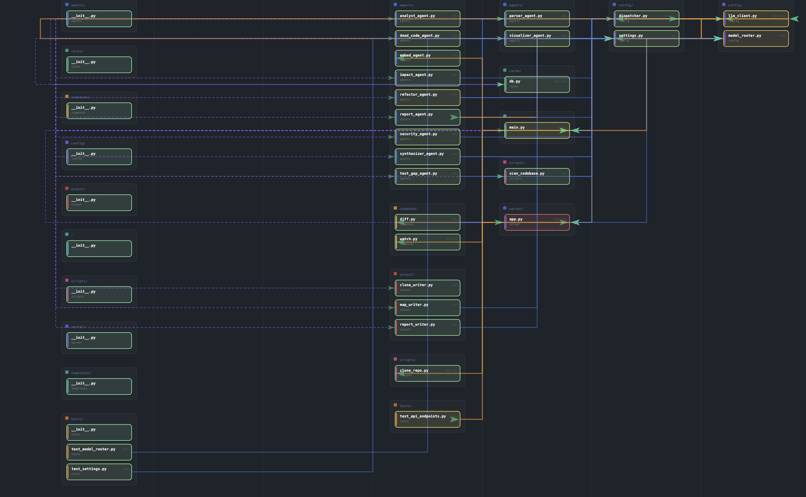
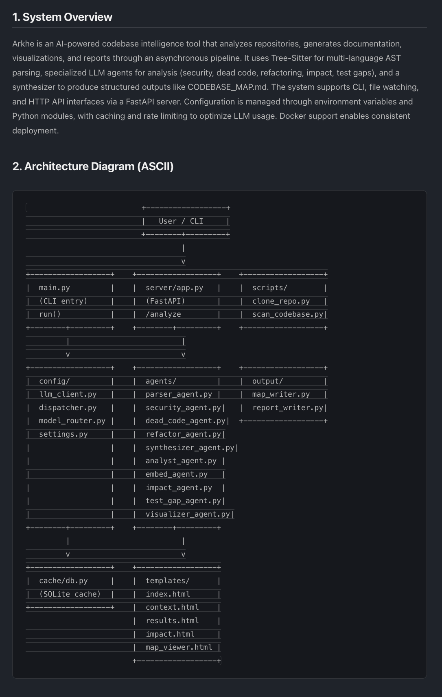
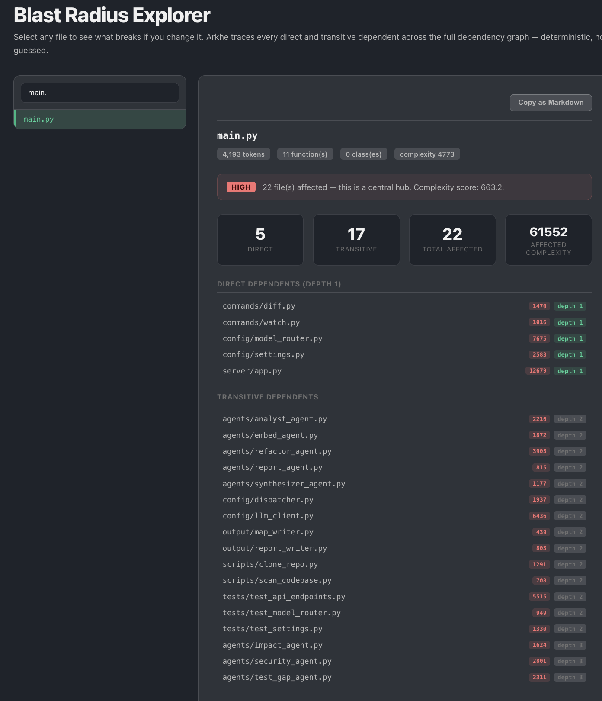
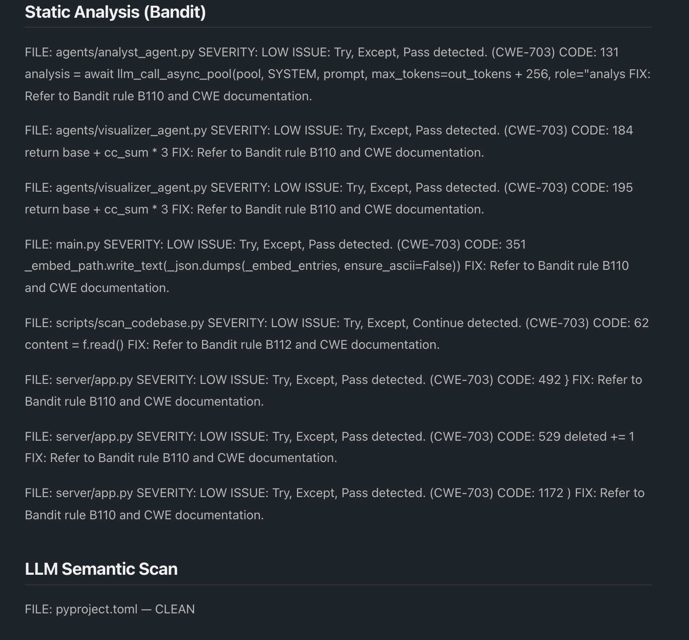
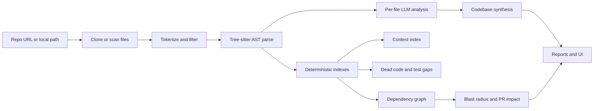

# Arkhe

**Autonomous codebase intelligence for understanding, documenting, and risk-scoring software repositories.**

Arkhe turns a GitHub, GitLab, or local repository into a structured engineering map: architecture documentation, dependency graphs, blast-radius analysis, security findings, dead-code reports, test-gap reports, and AI-ready context indexes. It is built as a deterministic metadata pipeline first, with LLM agents used only where semantic understanding is useful.

<p align="center">
  
</p>

## What Arkhe Answers

- What does this codebase do, and where are the important modules?
- Which files depend on this file if I change it?
- Which files are central, isolated, circular, or high-complexity?
- Which public functions are uncovered by tests?
- Which functions/classes look unused?
- Which files should fit into an AI context window for a task?
- Which security findings deserve a developer review?

## Highlights

| Area | What Arkhe Does |
| --- | --- |
| Repository ingestion | Clones public GitHub/GitLab repos or scans local paths while respecting `.gitignore`, size caps, and token caps. |
| Deterministic parsing | Uses Tree-sitter to extract functions, classes, imports, exports, and call graphs across 7 languages. |
| Dependency intelligence | Builds `GRAPH.json`, interactive D3.js maps, complexity heatmaps, hub-file lists, circular dependency detection, and blast-radius queries. |
| Incremental processing | Caches file-level AST and LLM analysis by SHA-256 content hash so unchanged files do not get reprocessed. |
| Model routing | Routes work through provider/model pools with RPM/TPM tracking, cooldown persistence, retries, and fallback across NVIDIA, Groq, Gemini, Anthropic, and OpenAI. |
| Production-style backend | FastAPI background jobs, Server-Sent Events progress, auth, BYOK key settings, PostgreSQL/Supabase or AWS RDS, and S3/Supabase Storage. |

## Product Tour

### Architecture and Codebase Map

Arkhe generates an engineer-readable `CODEBASE_MAP.md` with system overview, module guide, data flows, conventions, gotchas, and navigation notes.

<p align="center">
  
</p>

### Blast Radius Explorer

Select a file and Arkhe traces every direct and transitive dependent through the dependency graph. The result is deterministic graph traversal, not a guess from an LLM prompt.

<p align="center">
  
</p>

### Security and Test Intelligence

Security combines static analysis with semantic review. Test-gap analysis compares public functions against test coverage and call-graph reachability.

<p align="center">
  
</p>

## Outputs

| Output | Type | Purpose |
| --- | --- | --- |
| `docs/CODEBASE_MAP.md` | Markdown | Architecture narrative, module guide, data flows, conventions, and gotchas. |
| `docs/DEPENDENCY_MAP.html` | HTML | Interactive D3.js dependency graph with search, folders, heatmap, and isolated-node controls. |
| `docs/GRAPH.json` | JSON | Machine-readable nodes, edges, file metadata, complexity, imports, functions, and classes. |
| `docs/CONTEXT_INDEX.json` | JSON | Ranked file metadata and snippets for context packing and task-specific file selection. |
| `docs/EMBED_INDEX.json` | JSON | Per-file analysis prepared for semantic search indexing. |
| `docs/EXECUTIVE_REPORT.docx` | DOCX | Stakeholder-ready executive report when enabled. |
| `docs/SECURITY_REPORT.md` | Markdown | Bandit-backed static scan plus semantic security findings when enabled. |
| `docs/DEAD_CODE_REPORT.md` | Markdown | Potentially unused functions/classes using references, call graph, exports, and Vulture. |
| `docs/TEST_GAP_REPORT.md` | Markdown | Public functions without direct or indirect test coverage. |
| `docs/PR_IMPACT.md` | Markdown | Changed files and downstream impact versus a base branch. |
| `tests_generated/` | Python | Optional pytest scaffold files for uncovered functions. |

## How It Works



The pipeline is intentionally hybrid:

1. **Scan**: walks the repo, respects ignore rules, drops oversized files, and counts tokens with `tiktoken`.
2. **Parse**: extracts AST metadata with Tree-sitter for Python, JavaScript, TypeScript, Go, Rust, Java, and Ruby.
3. **Index**: builds graph data, context metadata, complexity scores, snapshots, and deterministic reports before LLM work.
4. **Analyze**: sends file batches through an async dispatcher with rate-aware model routing.
5. **Synthesize**: combines file-level analysis into architecture docs, reports, and interactive views.
6. **Persist**: caches local file analysis in SQLite and stores web job metadata/results in Supabase or AWS.

## Quick Start: CLI

Arkhe requires Python 3.11+.

```bash
git clone https://github.com/sync7319/Arkhe.git
cd Arkhe
uv sync
cp .env.example .env
```

Add at least one provider key to `.env`:

```bash
GROQ_API_KEY=...
GEMINI_API_KEY=...
NVIDIA_API_KEY=...
ANTHROPIC_API_KEY=...
OPENAI_API_KEY=...
```

Run Arkhe against the current repo:

```bash
uv run python main.py .
```

Analyze another local repo:

```bash
uv run python main.py ../my-project
```

Write machine-readable output:

```bash
uv run python main.py ../my-project --format json
```

Generate a refactored clone:

```bash
uv run python main.py ../my-project --refactor
```

## Quick Start: Web App

The web app accepts public GitHub/GitLab URLs, runs jobs in the background, streams progress, and serves result dashboards.

```bash
uv run uvicorn server.app:app --reload --port 8000
```

Open:

```text
http://localhost:8000
```

Web mode needs a database and storage backend. Choose Supabase or AWS in `.env`:

```bash
# Supabase
DB_BACKEND=supabase
STORAGE_BACKEND=supabase
SUPABASE_URL=...
SUPABASE_ANON_KEY=...
SUPABASE_SERVICE_KEY=...
SUPABASE_STORAGE_BUCKET=...

# AWS
DB_BACKEND=aws
STORAGE_BACKEND=aws
AWS_RDS_HOST=...
AWS_RDS_PASSWORD=...
AWS_S3_BUCKET=...
AWS_REGION=us-east-1
```

## Commands

After installing the package entrypoint, these commands are available:

```bash
uv pip install -e .
arkhe ./my-project
arkhe ./my-project --format json
arkhe ./my-project --refactor
arkhe diff ./my-project
arkhe watch ./my-project
```

During source development, the equivalent commands are:

```bash
uv run python main.py ./my-project
uv run python main.py diff ./my-project
uv run python main.py watch ./my-project
```

`diff` compares the current repository to the last `docs/SNAPSHOT.json` without LLM calls. `watch` reruns analysis after source-file changes settle.

## Feature Flags

Optional outputs are controlled by `options.env`:

```bash
CODEBASE_MAP_ENABLED=true
DEPENDENCY_MAP_ENABLED=true
COMPLEXITY_HEATMAP_ENABLED=true

SECURITY_AUDIT_ENABLED=true
DEAD_CODE_DETECTION_ENABLED=true
TEST_GAP_ANALYSIS_ENABLED=true
TEST_SCAFFOLDING_ENABLED=true
PR_ANALYSIS_ENABLED=true
PR_BASE_BRANCH=main

EXECUTIVE_REPORT_ENABLED=true
REFACTOR_ENABLED=true
REFACTOR_SPEED=thorough
```

By default, core documentation and dependency mapping are enabled, while deeper analyses are opt-in.

## Model Routing

Arkhe can use NVIDIA NIM, Groq, Gemini, Anthropic, and OpenAI. The dispatcher is designed for throughput and cost control:

- Files are routed by token size and file type.
- Workers share a queue instead of every file polling independently.
- RPM, TPM, request-per-day, and token-per-day limits are tracked.
- Rate-limited models enter cooldown and the next model is tried.
- Cooldowns persist in SQLite so restarts do not immediately retry blocked models.

You can also override all routing with a BYOK chain:

```bash
ARKHE_CHAIN=nvidia:nvidia/llama-3.1-nemotron-ultra-253b-v1:nvapi-...,groq:llama-3.3-70b-versatile:gsk-...
```

Format:

```text
provider:model:api_key,provider:model:api_key
```

## Supported Languages

Tree-sitter parsing currently supports:

| Language | Extracted Metadata |
| --- | --- |
| Python | functions, classes, imports, exports, calls |
| JavaScript | functions, classes, imports, calls |
| TypeScript / TSX | functions, classes, imports, calls |
| Go | functions, types, imports, calls |
| Rust | functions, structs, enums, traits, uses |
| Java | methods, constructors, classes, interfaces, imports |
| Ruby | methods, classes/modules, requires |

## API Surface

The FastAPI server exposes:

| Endpoint | Purpose |
| --- | --- |
| `POST /analyze` | Submit a public GitHub/GitLab repo URL for background analysis. |
| `GET /status/{job_id}` | Poll job status. |
| `GET /stream/{job_id}` | Stream job progress with Server-Sent Events. |
| `GET /results/{job_id}` | View generated outputs. |
| `POST /context/{job_id}` | Rank files for a task and token budget. |
| `GET /impact/{job_id}` | Query direct/transitive blast radius for a file. |
| `POST /ask/{job_id}` | Query the semantic search index if embeddings were built. |
| `GET /api/docs` | OpenAPI docs. |

## Project Structure

```text
Arkhe/
  agents/          LLM and static-analysis agents
  cache/           SQLite file cache and model cooldown persistence
  commands/        CLI subcommands: diff, watch
  config/          settings, model router, dispatcher, backend selection
  integrations/    Supabase and AWS database/storage implementations
  output/          writers for maps, reports, clones
  scripts/         repo clone and scan utilities
  server/          FastAPI app, templates, static assets
  tests/           unit and API tests
  templates/       dependency map HTML template
```

## Testing

```bash
uv run pytest
```

Useful targeted checks:

```bash
uv run pytest tests/test_model_router.py
uv run pytest tests/test_api_endpoints.py
uv run python -m py_compile server/app.py
```

## Notes and Limits

- Web cloning supports public GitHub and GitLab repository URLs.
- Security findings are leads for review, not final vulnerability judgments.
- Generated test scaffolds should be reviewed before committing to another project.
- The CLI can run locally with provider keys only; the web app also needs a configured database and storage backend.
- Keep `.env` local. Do not commit provider keys, database credentials, or cloud credentials.

## Roadmap

See [ROADMAP.md](ROADMAP.md) for planned work. Current priorities include stronger deployment hardening, richer result caching, better semantic search UX, and deeper language coverage.
